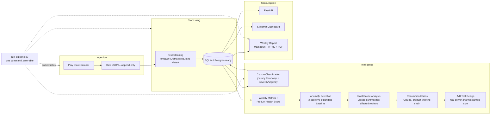

# Voice of Customer Intelligence Platform

**Automated Product Health Monitoring & Decision Support System**

A product-agnostic internal analytics platform that turns thousands of weekly customer reviews into
product-journey issue classification, a weekly Product Health Score, statistically-gated anomaly
alerts, evidence-backed root-cause findings, product-thinking recommendations, and A/B test proposals
with real power-analysis sample sizes — with zero manual reading required.

The case study in this repo runs on real Zomato Play Store reviews (5,000+ reviews scraped live, not a
Kaggle dataset), but the platform is not Zomato-specific: point the scraper config at Swiggy, Uber Eats,
DoorDash, Blinkit, Airbnb, or any Play Store app, and the same taxonomy/pipeline/dashboard runs
unchanged. It could equally run over internal support tickets if the ingestion adapter were swapped.

---

## The Business Problem

A Product Manager at a food-delivery scale app receives thousands of reviews a week. The manual
workflow — read reviews, categorize by hand, count complaints, write a report, share insights, propose
fixes, design experiments — does not scale, is slow, and is inconsistent between whoever happens to do
it that week. This platform automates every step of that workflow except the final judgment call of
which fix to actually ship.

## Architecture



Every stage reads/writes the same SQLite database (`db/voc.db`) — there is no hidden state in
notebooks or CSVs that the dashboard/API/report don't also see.

## Pipeline

| Stage | Module | What it does |
|---|---|---|
| Ingest | `src/ingestion/scrape_reviews.py` | Incremental Play Store scrape; stops early on already-seen reviewIds |
| Clean | `src/cleaning/clean_text.py` | Strips emoji/URLs/emails/whitespace, language detection, drops unusable rows |
| Load | `src/ingestion/load_to_db.py` | Idempotent upsert into SQLite |
| Classify | `src/classification/classify_reviews.py` | Claude, batched 10/call, forced tool-use for structured output |
| Validate | `src/classification/validate.py` | Random 200-sample export + precision/recall/F1/confusion matrix |
| Metrics | `src/metrics/compute_metrics.py` | Weekly aggregates + issue trends by category |
| Health Score | `src/metrics/health_score.py` | 40% Ratings / 30% Critical Issues / 20% Trend / 10% Crash, fully documented |
| Anomaly | `src/anomaly/detect_anomalies.py` | z-score vs expanding-window baseline, volume-gated |
| Root Cause | `src/root_cause/root_cause_analysis.py` | Pulls affected reviews, Claude summarizes theme + quotes |
| Recommend | `src/recommendations/generate_recommendations.py` | Product-thinking chain: cause → customer impact → business impact → fix |
| Experiment | `src/experiments/ab_test_design.py` | Real two-proportion power analysis + Claude narrative |
| Report | `src/reports/weekly_report.py` | Markdown + HTML + PDF weekly report |
| API | `src/api/main.py` | FastAPI read layer over the DB |
| Dashboard | `src/dashboard/app.py` | Streamlit, 11 pages incl. Strategic Roadmap + Root Cause story, filterable review explorer |
| Automate | `src/automation/run_pipeline.py` | Runs all of the above in one command |

## Product Thinking, Not ML

This is deliberately **not** a sentiment-analysis project. Every review is classified along the
**customer journey** (Discovery, Ordering, Payment, Fulfillment, Post-Order, Platform, Account —
see `src/common/db.py:TAXONOMY`), with sentiment, severity, and urgency layered on top as separate
axes — because a 5-star review can still describe a checkout bug the user worked around, and a PM
needs "where in the funnel" more than "was this review nice."

The LLM (Claude) is used for the two things it's actually good at: scalable multilingual text
classification and evidence-grounded summarization. Everything with a right answer — sample sizes,
z-scores, health score weighting — is deterministic code, not an LLM guess, and every formula is
documented inline with the reasoning behind its constants (see `src/metrics/health_score.py` and
`src/experiments/sample_size.py`).

## Product Health Score

```
Health Score = 40% × Rating subscore
             + 30% × Critical-Issue subscore
             + 20% × Trend subscore
             + 10% × Crash subscore
```

Weighted in the order a PM actually triages a week: the number leadership already sees (ratings)
first, revenue/trust-critical issues second, direction of travel third, and the narrowest single
failure mode (crashes) last. Full reasoning and threshold justification is in
`src/metrics/health_score.py`.

## Anomaly Detection Methodology

For each category, each week is compared against an **expanding window** of all prior weeks (not a
fixed rolling window) — a young deployment starts with almost no history, and a fixed 4-week window
would report "insufficient data" for a category's entire first month. `z_score = (this week − mean of
prior weeks) / std of prior weeks`, requiring ≥2 prior weeks. A `MIN_VOLUME_FOR_ALERT` gate (and a
separate review-count gate for rating drops) stops tiny-sample noise (2 reviews → 4 reviews) from
reading as a "100% spike." See `src/anomaly/detect_anomalies.py` for the full write-up.

## SQL Schema

Canonical DDL lives in [`db/schema.sql`](db/schema.sql) (PostgreSQL flavor) — the running system
executes the identical schema via SQLAlchemy on SQLite (`src/common/models.py`) for a zero-install
local demo. Moving to Postgres in production is a connection-string change, not a redesign.

Tables: `reviews`, `categories`, `review_classifications`, `classification_logs`, `weekly_metrics`,
`issue_trends`, `alerts`, `recommendations`, `experiments`, `dashboard_cache`.

## Known Limitation: Data Depth

Play Store's review API has no historical backfill beyond its pagination depth — for a
high-review-volume app like Zomato, ~5,000 reviews only reaches back about two weeks. This is stated
plainly rather than worked around with synthetic data: anomaly detection and trend analysis are
therefore designed to get statistically *more* reliable every week the platform keeps running (the
expanding-window baseline), not to fake multi-month history on day one. Re-running
`run_pipeline.py --incremental` weekly is how this platform is meant to accumulate real history.

## Tech Stack

Python · SQLite (Postgres-ready schema) · pandas/NumPy · Claude (Anthropic) or Gemini (Google) via a
provider-agnostic LLM client · FastAPI · Streamlit · Plotly · SQLAlchemy · pytest · google-play-scraper

### LLM provider

Every LLM call goes through `src/common/llm_client.py`, which dispatches to either provider based on
one env var — nothing else in the pipeline knows or cares which one is active:

```
LLM_PROVIDER=gemini      # or "anthropic"
GEMINI_API_KEY=...       # free tier at aistudio.google.com -> Get API key
# or
ANTHROPIC_API_KEY=...    # console.anthropic.com, pay-as-you-go
```

## Installation

```bash
cd voc-intelligence-platform
python -m venv .venv
.venv/Scripts/activate        # or source .venv/bin/activate on macOS/Linux
pip install -r requirements.txt
cp .env.example .env          # then add your ANTHROPIC_API_KEY
```

## Usage

```bash
# One command, full pipeline (ingest -> clean -> load -> classify -> metrics -> anomalies -> alerts -> report)
python -m src.automation.run_pipeline --incremental

# Individual steps
python -m src.ingestion.scrape_reviews --target 5000       # initial backfill
python -m src.classification.classify_reviews --limit 500  # classify a batch
python -m src.classification.validate sample --n 200        # export for manual labeling
python -m src.classification.validate score                 # after filling in human labels
python -m src.experiments.ab_test_design <recommendation_id>

# Serve
uvicorn src.api.main:app --reload --port 8000
streamlit run src/dashboard/app.py

# Test
pytest tests/ -v
```

## Automation

`src/automation/run_pipeline.py` is designed to be dropped straight into cron / Windows Task Scheduler
for a weekly run. Each of its 8 steps is independently error-isolated — a Claude rate-limit failure on
step 4 doesn't prevent steps 5-8 from running against whatever was already classified; the run summary
at the end reports exactly what succeeded, what failed, and what was skipped.

---

## Resume Bullets

- Built an end-to-end product analytics platform ingesting 5,000+ real customer reviews, classifying
  them via LLM into a 17-category product-journey taxonomy with severity/urgency/confidence scoring,
  and validating classification quality against a 200-review human-labeled sample (precision/recall/F1).
- Designed a weighted Product Health Score and z-score-based anomaly detection system (expanding-window
  baseline, volume-gated) that automatically surfaces evidence-backed root-cause findings and
  product-thinking recommendations for a PM to act on.
- Implemented a real two-proportion power-analysis sample-size calculator to turn recommendations into
  rigorous A/B test proposals (hypothesis, guardrails, sample size, duration, rollout plan).
- Shipped a normalized 10-table SQL schema, FastAPI service, 9-page Streamlit dashboard, and a
  single-command automation pipeline suitable for weekly cron scheduling — with unit + integration test
  coverage (32 tests) and zero manual review of the raw data required.

## Interview Talking Points

- **"Why isn't this sentiment analysis?"** Because a PM needs to know *where in the funnel* an issue
  occurs, not whether the review sounds happy — a 5-star review can still name a checkout bug.
  Sentiment/severity/urgency are separate axes classified alongside the journey category.
- **"Why batch 10 reviews per LLM call instead of 1?"** Cost and latency scale linearly with call
  count, not review count; batching is the single biggest lever on classification cost at this volume.
- **"Why an expanding window instead of a fixed rolling window for anomaly baselines?"** A new
  deployment has almost no history; a fixed 4-week window would refuse to alert on anything in its
  first month. The tradeoff (documented in code) is re-evaluating this once 12+ weeks of history exist,
  switching to a trailing window so the baseline can track slow seasonal drift.
- **"Why compute sample size with scipy instead of asking the LLM?"** Anything with a mathematically
  correct answer should never be delegated to an LLM guess — the LLM's job here is narrative framing on
  top of numbers that are already correct.
- **"What's the biggest limitation you'd flag to a hiring manager?"** The Play Store data source caps
  historical depth at roughly two weeks for a high-volume app — explicitly documented rather than
  patched over, and the anomaly system is designed to get more reliable as more weekly runs accumulate.

## Future Improvements

- Swap SQLite for the documented Postgres schema (`db/schema.sql`) and add connection pooling.
- Switch anomaly baselines from expanding-window to trailing N-week windows once enough history exists.
- Add a `dashboard_cache` writer (table already exists) so the API doesn't recompute aggregations live.
- Add a second ingestion adapter (App Store, or an internal support-ticket export) to prove out the
  "product-agnostic" claim with a second real data source.
