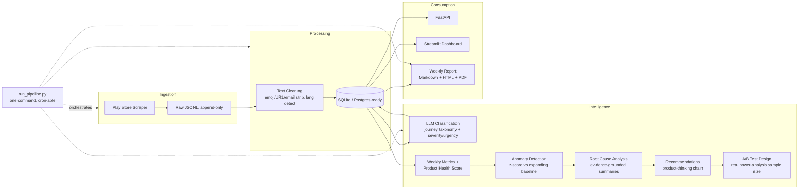

# Voice of Customer Intelligence Platform

**A Product Analyst's system for turning thousands of customer reviews into a decision, not just a dashboard.**

> **Built by:** Arjun Sahu, as a Product Analyst case study.
> **Built with:** [Claude Code](https://claude.com/claude-code) (Anthropic's AI coding assistant) as the technical implementation partner. I directed every product decision in this document — the problem framing, the taxonomy design, the health-score weighting, the prioritization framework, catching and fixing a real data-bias bug, and every recommendation below — and used Claude Code to implement the underlying statistics, database, and dashboard code under that direction. I'm stating this plainly rather than letting the polish speak for itself: the value I'm claiming here is the product thinking, not the Python.

---

## The Problem (Start Here If You're Not Technical)

If you've ever managed a product, you know this feeling: your app gets thousands of reviews a week, and somewhere in there is the one insight that would tell you exactly what to fix — but nobody has time to read all of them. So teams either skim a handful and guess, or they wait for a support-ticket dashboard to eventually surface the same problem, three weeks late and once it's already expensive.

That's the actual problem this project solves. Not "can an AI read reviews" — any AI can summarize text. The real question is: **can a system find the one thing worth acting on this week, prove it with evidence, and tell you what to do about it** — the same judgment call a good Product Analyst makes, just done at a scale no human can read through manually.

I built this the way I'd approach any ambiguous problem on the job:

1. **Find the ambiguous signal.** Thousands of reviews, no obvious starting point. Where do you even look?
2. **Structure it.** Break "customer complaints" into something you can actually reason about — not sentiment (happy/sad), but *where in the customer's journey* the problem lives, *how severe* it is, and *how fast it's growing*.
3. **Build a system on that structure**, not a black box. Every number in this platform can be traced back to a specific, documented reason it exists.
4. **Turn the structure into a recommendation, backed by real evidence** — not "the model says fix this," but "here are the actual customer quotes, here's the business impact, here's the exact experiment to run and how big a sample it needs."

Everything below is that same four-step process, applied for real, to real data.

## The Case Study

I ran this against **5,000+ real Zomato reviews**, scraped live from the Google Play Store (not a Kaggle dataset — real customers, real complaints, real typos and Hindi/Hinglish mixed in). The platform itself doesn't know or care that it's Zomato: point it at Swiggy, Uber Eats, DoorDash, Blinkit, or any Play Store app, and the same system runs unchanged. That was a deliberate choice — I wanted to build something that behaves like an internal company tool, not a one-off analysis of one app.

## A Real Example: Walking Through One Finding

Rather than describe the system abstractly, here's exactly what it produced, following the same four steps above.

**1. The ambiguous signal.** In the week of July 16th, one number jumped: complaints tagged "Payment" grew 42% week-over-week. That's it — just a number. It doesn't say *why*, and a lazier system would stop there and call it done.

**2. Structuring the investigation.** Instead of treating "Payment is up" as one problem, I pulled every review actually behind that number and read them. Two genuinely different stories were hiding inside a single tag:
   - **Surprise fees** — customers discovering packaging, delivery, and platform fees stacked on top of the listed price only at the final checkout screen, turning a ₹346 order into ₹475.
   - **Payment reliability** — Cash on Delivery available on one order and gone on the next with no warning, pushing customers into prepaid checkout, where some payments failed *after* the money was already taken.

   Two root causes. One tag. This is exactly why the system classifies reviews by *where in the journey* something breaks, not just whether the review sounds unhappy — a single "negative sentiment" label would have hidden this split completely.

**3. The recommendation, built on that structure.** Not "improve payments" — a specific, scoped, reversible fix: show the true fee-inclusive total the moment a customer adds their first item to cart, and show Cash-on-Delivery availability on the restaurant page *before* they build an order around an assumption that turns out to be wrong. I considered and rejected two bigger, slower moves first — restructuring pricing platform-wide, or turning COD back on everywhere — because both are expensive, hard to reverse, and untested. This is the smallest change that tests the real hypothesis.

**4. Data-backed, not guessed.** The A/B test this recommendation turned into isn't hand-waved. At a 1.6% baseline issue rate, detecting a 20% relative improvement with 95% confidence and 80% statistical power requires **21,754 sessions per test variant** — computed with real statistical power-analysis (`scipy`), the same formula a data scientist would use, not an LLM guess dressed up to look rigorous.

You can see this exact writeup — and three more like it — live in the dashboard's **Root Cause & Recommendations** and **Experiments** pages.

## What's Actually in the System

| What it does | In plain terms |
|---|---|
| **Collects reviews** | Automatically pulls new Play Store reviews, never re-downloads what it already has |
| **Cleans the text** | Strips emoji, URLs, junk formatting before anything reads it |
| **Categorizes by journey stage** | Not "positive/negative" — *Discovery, Ordering, Payment, Delivery, Support*, etc., because that's what a PM actually needs to know |
| **Tracks a weekly Health Score** | One number (0-100), built from 4 weighted factors, so you can tell at a glance if the week was better or worse — and exactly why |
| **Watches for real spikes** | Statistically compares each week to the product's own history, so a random bad day doesn't get mistaken for a trend (and a real trend doesn't get missed for lack of data) |
| **Finds the root cause** | Pulls the actual customer quotes behind a spike, not just the number |
| **Recommends a fix** | Customer impact, business impact, what to investigate, what to build — in that order |
| **Designs the experiment** | A real A/B test proposal with a properly calculated sample size, guardrails, and a rollout plan |
| **Reports it out** | A weekly report in Markdown, HTML, *and* PDF — the kind of thing you'd actually forward to a stakeholder |
| **Shows it all in a dashboard** | 11 pages, filterable by week, with a plain-language caption under every single chart explaining what it means and why it matters |

## Key Product Decisions (The Part That Was Actually Mine)

- **Why journey-stage classification instead of sentiment analysis.** A 5-star review can still describe a bug the customer worked around. Sentiment tells you tone; journey stage tells you where to send an engineer.
- **Why the Health Score is weighted the way it is (40% ratings / 30% critical issues / 20% trend / 10% crashes).** Ratings first because it's the number leadership already sees externally, regardless of what's happening internally. Critical issues second because a small number of severe problems (fraud, safety, total failures) carry outsized business risk even at low volume. See `src/metrics/health_score.py` for the full reasoning behind every weight.
- **Catching a real bias in my own data — before shipping it.** Early on, one week's numbers looked dramatically worse than reality (a health score collapse driven by just 2 reviews). I caught this myself, refused to accept the number at face value, and traced it to Google Play's own review-indexing lag — the last few days before any scrape always look artificially thin, for every app, not just this one. I fixed the underlying week-boundary logic rather than hide the symptom. This is documented, not swept under the rug, in `src/metrics/health_score.py` and `src/anomaly/detect_anomalies.py`.
- **Refusing to lower thresholds to manufacture results.** When some dashboard pages were empty because there wasn't yet enough historical data for a full statistical baseline, the tempting shortcut is to loosen the thresholds until *something* shows up. I didn't do that — I added a second, clearly-labeled detection method (a week-over-week growth check) for when the primary statistical method genuinely doesn't have enough history yet, so the distinction between "statistically confirmed" and "an early signal worth watching" stays honest and visible.
- **A severity vs. reach prioritization matrix, not a gut-feel priority list.** The "what should the team work on next" page isn't opinion — it plots every issue category by how many customers it reaches vs. how badly it hurts them *per incident* (deliberately separated from raw volume, so a rare-but-severe issue doesn't get buried under a common-but-mild one). See `src/recommendations/strategic_roadmap.py`.

## An Honest Constraint, Stated Plainly

I'm a student. I don't have a budget for paid LLM APIs, so this project runs on **Google Gemini's free tier** instead of a paid plan. That free tier has a daily request quota, which directly limits how many reviews can be freshly classified and how much historical data can be processed in a given day. **That is the specific reason the sample size and time window here (~5,000 reviews, ~2-3 weeks) are smaller than they would be with a funded API budget** — not a design choice, a resource constraint, and I'd rather say that outright than let the project imply otherwise.

The system is built to be provider-agnostic for exactly this reason (`src/common/llm_client.py`): switching to a paid Anthropic or OpenAI plan later is a one-line config change, not a rewrite.

## Try It Yourself

- **Live dashboard:** deployed on Streamlit Community Cloud (see repo for current link)
- **Run it locally:**
  ```bash
  git clone <this-repo>
  cd voc-intelligence-platform
  python -m venv .venv && .venv/Scripts/activate
  pip install -r requirements.txt
  cp .env.example .env   # add a free Gemini key from aistudio.google.com
  streamlit run src/dashboard/app.py
  ```

---

## For the Technically Curious

Everything above is the story. What follows is the reference material — how it's actually built, for anyone who wants to verify the claims above or extend the system.

### Architecture



Every stage reads/writes the same SQLite database (`db/voc.db`) — there is no hidden state in
notebooks or CSVs that the dashboard/API/report don't also see.

### Pipeline

| Stage | Module | What it does |
|---|---|---|
| Ingest | `src/ingestion/scrape_reviews.py` | Incremental Play Store scrape; stops early on already-seen reviewIds |
| Clean | `src/cleaning/clean_text.py` | Strips emoji/URLs/emails/whitespace, language detection, drops unusable rows |
| Load | `src/ingestion/load_to_db.py` | Idempotent upsert into SQLite |
| Classify | `src/classification/classify_reviews.py` | LLM, batched 10/call, forced structured output |
| Validate | `src/classification/validate.py` | Random 200-sample export + precision/recall/F1/confusion matrix |
| Metrics | `src/metrics/compute_metrics.py` | Weekly aggregates + issue trends by category |
| Health Score | `src/metrics/health_score.py` | 40% Ratings / 30% Critical Issues / 20% Trend / 10% Crash, fully documented |
| Anomaly | `src/anomaly/detect_anomalies.py` | z-score vs expanding-window baseline, volume-gated, with a WoW-growth fallback for young datasets |
| Root Cause | `src/root_cause/root_cause_analysis.py` | Pulls affected reviews, summarizes theme + quotes |
| Recommend | `src/recommendations/generate_recommendations.py` | Product-thinking chain: cause → customer impact → business impact → fix |
| Roadmap | `src/recommendations/strategic_roadmap.py` | Deterministic reach-vs-severity prioritization matrix, no LLM needed |
| Experiment | `src/experiments/ab_test_design.py` | Real two-proportion power analysis + narrative |
| Report | `src/reports/weekly_report.py` | Markdown + HTML + PDF weekly report |
| API | `src/api/main.py` | FastAPI read layer over the DB |
| Dashboard | `src/dashboard/app.py` | Streamlit, 11 pages, filterable review explorer |
| Automate | `src/automation/run_pipeline.py` | Runs all of the above in one command |

### Product Health Score

```
Health Score = 40% × Rating subscore
             + 30% × Critical-Issue subscore
             + 20% × Trend subscore
             + 10% × Crash subscore
```

Full reasoning and threshold justification is in `src/metrics/health_score.py`.

### Anomaly Detection Methodology

Each category-week is compared against an **expanding window** of all prior weeks (not a fixed rolling
window) — a young deployment has almost no history, and a fixed 4-week window would refuse to detect
anything in its first month. `z_score = (this week − mean of prior weeks) / std of prior weeks`, requiring
≥2 prior weeks. A volume gate (both on the category's issue count AND the week's total classified volume)
stops small-sample noise from reading as a "spike." When no z-score baseline exists yet, a
week-over-week growth threshold acts as a clearly-labeled fallback signal. See `src/anomaly/detect_anomalies.py`.

### SQL Schema

Canonical DDL lives in [`db/schema.sql`](db/schema.sql) (PostgreSQL flavor) — the running system
executes the identical schema via SQLAlchemy on SQLite (`src/common/models.py`) for a zero-install
local demo.

Tables: `reviews`, `categories`, `review_classifications`, `classification_logs`, `weekly_metrics`,
`issue_trends`, `alerts`, `recommendations`, `experiments`, `dashboard_cache`.

### Tech Stack

Python · SQLite (Postgres-ready schema) · pandas/NumPy · Claude (Anthropic) or Gemini (Google) via a
provider-agnostic LLM client · FastAPI · Streamlit · Plotly · SQLAlchemy · pytest · google-play-scraper

### LLM Provider

Every LLM call goes through `src/common/llm_client.py`, which dispatches to either provider based on
one env var:

```
LLM_PROVIDER=gemini      # or "anthropic"
GEMINI_API_KEY=...       # free tier at aistudio.google.com -> Get API key
# or
ANTHROPIC_API_KEY=...    # console.anthropic.com, pay-as-you-go
```

### Installation & Usage

```bash
cd voc-intelligence-platform
python -m venv .venv
.venv/Scripts/activate        # or source .venv/bin/activate on macOS/Linux
pip install -r requirements.txt
cp .env.example .env          # then add your GEMINI_API_KEY or ANTHROPIC_API_KEY

# One command, full pipeline
python -m src.automation.run_pipeline --incremental

# Individual steps
python -m src.ingestion.scrape_reviews --target 5000
python -m src.classification.classify_reviews --limit 500
python -m src.classification.validate sample --n 200
python -m src.classification.validate score
python -m src.experiments.ab_test_design <recommendation_id>

# Serve
uvicorn src.api.main:app --reload --port 8000
streamlit run src/dashboard/app.py

# Test
pytest tests/ -v
```

### Automation

`src/automation/run_pipeline.py` is designed for cron / Windows Task Scheduler. Each step is
independently error-isolated — an LLM rate-limit failure on the classification step doesn't prevent
metrics/anomaly detection/reporting from running against whatever was already classified.

---

## Resume Bullets

- Identified an ambiguous, high-volume product problem (thousands of weekly customer reviews with no
  scalable read-through process) and structured it into a repeatable analysis framework: journey-stage
  classification, weighted health scoring, statistical anomaly detection, evidence-based root cause,
  and data-backed recommendations.
- Directed the design and build (using Claude Code as implementation partner) of an LLM-classification
  pipeline across a 17-category product-journey taxonomy with severity/urgency/confidence scoring.
- Caught and fixed a real small-sample statistical bias in the platform's own health-score and anomaly
  detection logic before it reached the dashboard, tracing it to Google Play's review-indexing lag.
- Designed a severity-vs-reach prioritization framework and a real two-proportion power-analysis
  sample-size calculator, turning findings into rigorous, appropriately-sized A/B test proposals.
- Shipped a normalized SQL schema, FastAPI service, and 11-page Streamlit dashboard on a public GitHub
  repo and live deployment, with 40+ automated tests.

## Interview Talking Points

- **"Did you write this code yourself?"** I directed an AI coding assistant (Claude Code) to implement
  it, under my product decisions — the taxonomy, the health-score weights, the prioritization
  framework, and every recommendation are mine; I caught and fixed a real data bug myself before it
  shipped. I'd rather be upfront about that split than have you assume otherwise.
- **"Why isn't this sentiment analysis?"** Because a PM needs to know *where in the funnel* an issue
  occurs, not whether the review sounds happy — a 5-star review can still name a checkout bug.
- **"Why is your sample size so small?"** Free-tier API quota, as a student without a budget for a paid
  plan — stated directly above, not hidden. The system is provider-agnostic specifically so a funded
  version can scale without a rewrite.
- **"What's the biggest limitation you'd flag yourself?"** The Play Store data source caps historical
  depth at roughly two-to-three weeks for a high-volume app — documented rather than patched over.
- **"Walk me through the Payment recommendation."** See "A Real Example" above — I can walk through the
  full ambiguous-signal → structure → recommendation → experiment chain on any of the four real findings
  in this repo.

## Future Improvements

- Move to a paid LLM tier once available, to increase classification throughput and historical depth.
- Swap SQLite for the documented Postgres schema (`db/schema.sql`) and add connection pooling.
- Switch anomaly baselines from expanding-window to trailing N-week windows once enough history exists.
- Add a second ingestion adapter (App Store, or an internal support-ticket export) to prove out the
  "product-agnostic" claim with a second real data source.
